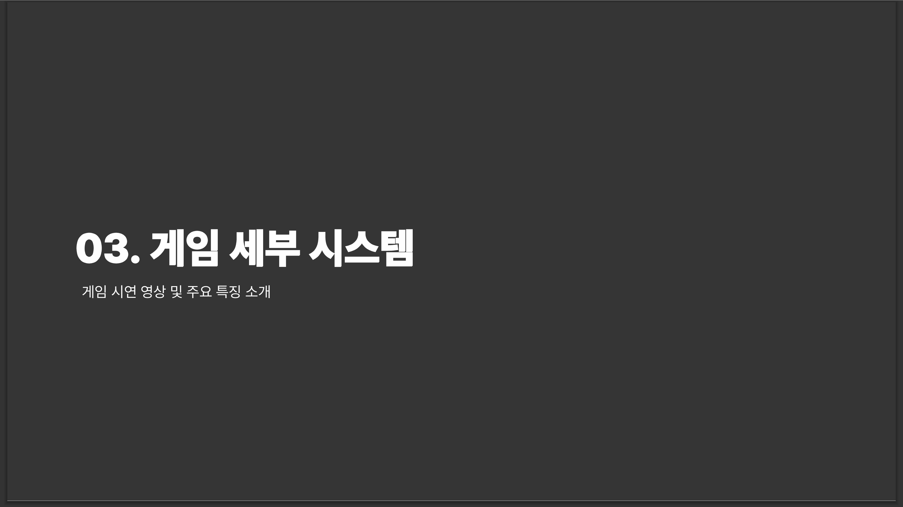

**GameJam 일정** 
- [GameJam 1차](https://github.com/LeeeJooo/GameJam_EdgeRunner) : (4일) 2024년 9월 2일 월요일 ~ 2024년 9월 5일 목요일
- **GameJam 2차** : (6일) 2024년 9월 6일 금요일 ~ 2024년 9월 11일 수요일 

**GameJam 2차** 
- **주제** : Ball 
- **인원** : 3명 (Game Designer, Client Programmer, Server Programmmer) 

**How to Install LoopRunner** 
참고 : 안드로이드에서만 설치할 수 있습니다. 
1. [InstallGame](https://github.com/LeeeJooo/GameJam_LoopRunner/tree/main/InstallGame)의 LoopRunner.apk 파일을 설치하고자 하는 모바일 기기에 다운로드 합니다.
2. 모바일 기기에서 apk 파일을 열고 게임을 설치합니다.
  
# PROJECT 소개

